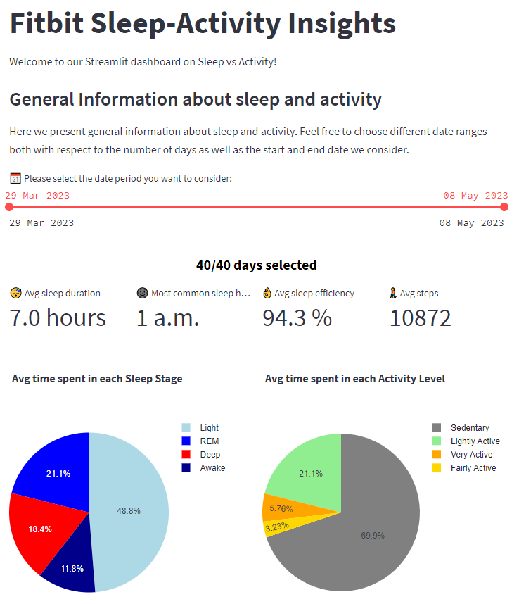
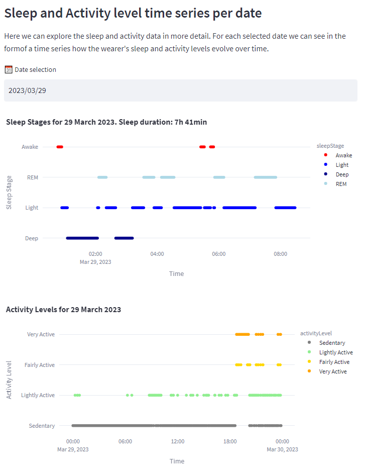
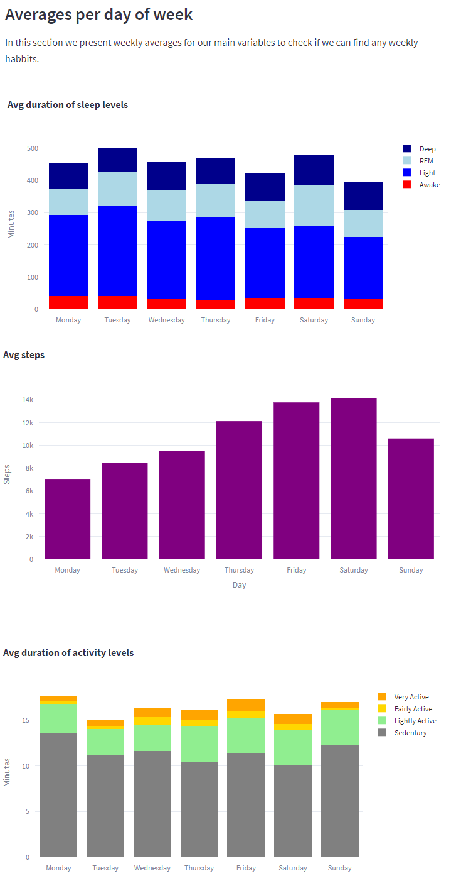
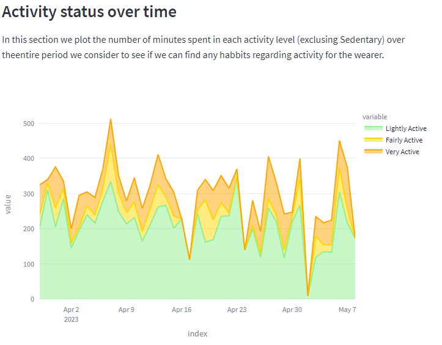
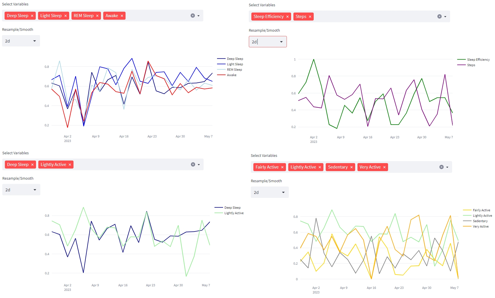

# FitbitProject

In this project we use the Fitbit API to gather data from a Fitbit Sense that one of our team members wore, save the data to a MongoDB collection and then create some visualizations using Streamlit.

* For more details, please check out the [full report](documents/report.md).
* For a quick pitch-like presentation, please check [here](documents/FitBit-Presentation.pptx).

## Contents
- [Contributors](#contributors)
- [Key takeaways](#key-takeaways)
- [Streamlit app - Details](#streamlit-app-details)
  - [General Information about Sleep and Activity](#general-information-about-sleep-and-activity)
  - [Sleep and Activity time series per date](#sleep-and-activity-time-series-per-date)
  - [Averages per day of week](#averages-per-day-of-week)
  - [Activity status over time](#activity-status-over-time)
  - [Detailed Time Series comparision](#detailed-time-series-comparision)
- [Usefull links](#usefull-links)

## Contributors
|NAME|Github handle|
|:----------------|:----------------:|
|Theodoros Diamantidis|ThDiamant|
|Pantelis Ypsilantis|pantelisy|
|Grigoris Barmpas|GregB712|
|Costas Tsikinis|costas-tsik|

## Key takeaways

* The wearer is a relatively active person achieving the 10k steps mark in general. They prefer to exercise either before 12:00 or around 18:00. They are most active on Fridays and Saturdays and the least active on Mondays. Their activiy profile is characterized by days of higher activity followed by a couple of less active days.

* The wearer seems to be getting adequate sleep, although they are a bit of a night owl!.Around 50% of their sleep is spend in Light sleep stage, with an oscillation between Deep and Light sleep on most days. There doesn't seem to be a day in the week when they sleep best.

* High step count is mostly due to intense rather than light activity. Exercise seems to positively affect Light Sleep the most. Deep sleep and Light Activity also seem to go together.

## Streamlit app - Details

Let us see in more detail how we arrive to our key takeaways, as well as any other conclusions.

### General Information about Sleep and Activity

  

After selecting different date ranges, we gather the following key insights:

* Wearer seems to be getting enough sleep (7-9 hours), although they are a bit of a nightowl sleeping generally around midnight or even past midnight.

* Sleep patterns: Light Sleep accounts for 50% of the sleep stages, with the next larger sleep stage being REM sleep with roughly 20% of the sleep.

* Active person: achieving the general goal of 10.000 steps per day on average. This translates to being active for a bit more than 1/4 of the day, but still almost 3/4 of the wearer's day is in a sedentary state (!).

### Sleep and Activity time series per date

  

After examining the data for different dates through the widget, we can see the following:

* Interesting pattern: oscillation between REM > Light > Deep or just REM > Light.

* Gym hours found: Spike in activity (Fairly, Very Active) around 18:00.

> **_Fun observation_**!
>> Increased activity level around midnight of 29 March. We know for a fact that on that day and hour, the wearer was at a live gig, so we can actually see them enjoying themselves in the crowd by producing high levels of activity!

### Averages per day of week

  

Several interesting conclusions:

* Most variation in sleep stages comes mostly from the number of minutes in Light sleep.

* Steps:

    * Wearer is increasingly active as the week progresses, with Saturday being the day they are mostly active, closely followed by Friday. Given that most people go out with friends, or take quick weekend trips on these days, this can explain the high number of steps on these days. One thing is clear from this graph though: 

    * The wearer does not seem to like Mondays since they seem to be the days they are mostly sedentary! This can be seen even more clearly from the activity level breakdown per day of week:

* Activity levels' breakdown:

    * Minutes sedentary inversly related to the their number of steps (second graph). 
    
    * Activity on active days seems to come from being "Very Active".

### Activity status over time

  

> **_Possible pattern_**!
>> The wearer seems to spend some days in which they are very active, followed by a few days in which they are not as active as opposed to a habbit or lifestyle in which they are more or less consistently active throughout time.

### Detailed Time Series comparision

  

Some interesting remarks from this plot are:

* Sleep levels seem to be very correlated with each other.

* There does seem to be a correlation between steps and sleep efficiency: many days with relatively high number of steps are followed by days with relatively high sleep efficiency score.

* Deep sleep and Light Activity also seem to correlate relatively well. This is the type of activity with which Deep Sleep correlates best, which is a bit surprising: it seems like deep sleep does not necessary require very intense exercise.

* Activity levels (light, fair, very active) seem anticorrelated with the sedentary timeseries and correlated with each other as we have seen before.

## Usefull links
Documentation for activity timeseries: https://dev.fitbit.com/build/reference/web-api/activity-timeseries/

Fitbit WebAPI Explorer: https://dev.fitbit.com/build/reference/web-api/explore/

Fitbit init tutorial: https://towardsdatascience.com/using-the-fitbit-web-api-with-python-f29f119621ea