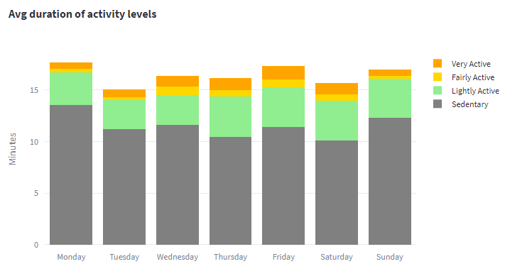
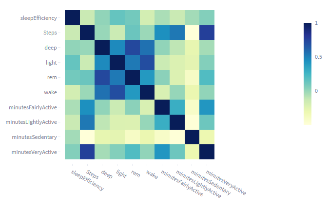

# Exploring Fitbit data with MongoDb and Python Streamlit

The Internet of Things (IoT) is a network of physical objects, devices, vehicles, buildings, and other items that are embedded with sensors, software, and connectivity, allowing them to collect and exchange data. One popular type of IoT devices are wearables, which are electronic devices that can be worn on the body as accessories or implants, such as smartwatches, fitness trackers, and medical monitoring devices. Wearables can track various data such as physical activity, heart rate, sleep patterns, and more. They have become increasingly popular due to their ability to provide users with personalized health and fitness data, as well as convenience and ease of use. Wearables can also be used in various industries, such as healthcare, sports, and entertainment, and have the potential to revolutionize the way we interact with technology on a daily basis.

One such device is Fitbit. Fitbit is the brand name for a series of smartwatches focused around, you guessed it, fitness. By wearing a fitbit you can have either through the smartwatch itself, or, in more detail, through the corresponding app, a data-based picture about different aspects of your life like sleep and activity.

If you are a tech person though you are not just limited on the visualizations or metrics that the Fitbit app provides. Fitbit allows developers to access a user's data (with the user's concent of course) in order to be able to either explore the data in the way they deem best, or more generally, build their own applications.

For this project, our team was given a Fitbit Sense, which was worn by one of the people in the team in order to gather different data. Then, through the Fitbit API we were able to draw the data we wanted and with the help of MongoDb, a document based database, those data in order to process them according to our needs.

In this tutorial, we will go through the process of installing and set up MongoDb, creating Fitbit developer account, saving Fitbit data to a local MongoDb and using the saved data to display the data through python in a Streamlit website.

More specifically this article contains the following sections:

A. Installing and setting up MongoDb.

B. Creation of Fitbit account.

C. Fetching of Fitbit data

D. Saving of data to MongoDb.

E. Streamlit setup to display the data

F. Usage of Machine Learning algorithm in order to generate knowledge

G. Implementation of python code to simulate streaming

## Installing and setting up MongoDb

To get started, download MongoDB Community Edition from the [official website](https://www.mongodb.com/try/download/community).

Select the desired version and OS system. For Windows execute the MSI file and install MongoDB Compass

Then, we need to add the bin folder (usually the path to the folder will look like `C:\Program Files\MongoDB\Server\6.0\bin`) to the environmental variables of Windows.

Open a terminal and execute the following to make sure that MongoDB is installed correctly:

``` bash
mongod --version
```

Create a data directory for MongoDB. Open a terminal and run the following command:

``` bash
mkdir C:\data\db
```

This command will create a directory named "db" in the "data" directory on your C drive. MongoDB uses this directory to store its data.

Then to start the server you need to execute the following:

``` bash
mongod
```

## Creation of Fitbit developer account

Having set up our MongoDB, we will now see how to create a developer account for fitbit and register our application so that we can start drawing data from Fitbit's API.

You can find a detailed guide on how to do the above in [this](https://towardsdatascience.com/using-the-fitbit-web-api-with-python-f29f119621ea) great article by Michael Galarnyk, but we will also briefly cover some of the main steps.

First of all you have to [create a Fitbit account](https://accounts.fitbit.com/signup?targetUrl=https%3A%2F%2Fwww.fitbit.com%2Flogin%2Ftransferpage%3Fredirect%3Dhttps%253A%252F%252Fwww.fitbit.com&emailSubscribe=false&lcl=en_EU), which is very straightforward. The second and very important step is to register your application. To do that, click [here](https://accounts.fitbit.com/signup?targetUrl=https%3A%2F%2Fwww.fitbit.com%2Flogin%2Ftransferpage%3Fredirect%3Dhttps%253A%252F%252Fwww.fitbit.com&emailSubscribe=false&lcl=en_EU), and then from the top right select Manage>Register An App. In this step, there are two things we have to take care of:

1. Make sure to select "Personal" in the OAuth 2.0 Application Type. This will give you access to the "intraday" API endpoints, which basically contain more fine-grained time series on different topics. As an example, instead of getting the time serries which contains just the overall number of steps for each day, you will be able to access the time series representing the number of steps per second or 15 seconds for each day. This can be interesting for a number of reasons that we will cover later.

2. In the callback URL, use http://127.0.0.1:8080/ (i.e. localhost). This is important especially if you want to use the python-fitbit module for your API requests, since it is hardcoded in the module itself.

Upon completing this stage, you will be shown a picture like this:


Make sure to note all the information here, **especially** the *OAuth 2.0 Client ID* and *Client Server*, since these will be important for the authentication step in python.

And that's it with setting up the application! Make sure to wear the watch for a day and then you will be ready to get your data from Fitbit's API. Before we move on though, there's one important thing we should mention.

If you are interested in exploring data regarding Breathing rate, SpO2 levels (a.k.a. Oxygen Saturation) as well as Heart Rate Variability, there is one more small step you have to follow:

In the Fitbit app on your phone, tap on the "Today" tile, and then make sure to scroll down until you find the "Health Metrics" tile. Tap it, and then allow the device to start collecting the related data. If you don't do this step, even if you are wearing your device, it will **not** gather the data I mentioned until you manually enable it like we just discussed.


## Interacting with the Fitbit API

In this section we will be using the `python-fitbit` and the `requests` modules to get data from the Fitbit API. This is not the only way to do it, for example, a simple alternative would be to use the [Fitbit Web API Explorer](https://dev.fitbit.com/build/reference/web-api/explore/).

First, we have to proceed with the authorization from the Fitbit API and also define the Fitbit object in python which will be used to make some GET requests to the Fitbit API. In order to perform the authentication we will need the `CLIENT_ID` and `CLIENT_SECRET` which we ad saved during the creation of the Fitbit account. So, to proceed with the authentication the following code should be executed:

``` python
# Authorize user
server = Oauth2.OAuth2Server(CLIENT_ID, CLIENT_SECRET)
server.browser_authorize()
# Save access and refresh tokens
ACCESS_TOKEN = str(server.fitbit.client.session.token['access_token'])
REFRESH_TOKEN = str(server.fitbit.client.session.token['refresh_token'])
EXPIRES_AT = str(server.fitbit.client.session.token['expires_at'])
```

Executing this codeblock, will redirect us to another tab in which we will be asked to login into our Fitbit account. Upon doing that we will see a page that should say something like "You are now authorized to access the Fitbit API!".

Given that the authentication has been completed as expected now we have an access token, a refresh token and the datetime when the access token will expire. By using them, we can proceed with the initialization of Fitbit object. So, to initialize it, the following code should be executed:

``` python
auth2_client = fitbit.Fitbit(client_id = CLIENT_ID,
                             client_secret = CLIENT_SECRET,
                             expires_at = EXPIRES_AT,
                             oauth2 = True,
                             access_token = ACCESS_TOKEN,
                             refresh_token = REFRESH_TOKEN)
```

## Fetching of Fitbit data and saving to MongoDb

Now we are set and ready to proceed with fetching the Fitbit data. In this tutorial we will focus on two categories of data, the Sleep related data and the Activity related data or to be more precise the data which have to do with the level of our activity and the data which have to do with the number of our steps.

To get the Sleep related data we will use `requests` module, due to the fact that `python-fitbit` module has not been updated for a long time and it is using an older API version which is hardcoded in it's codebase. So, as we need to use version 1.2 instead of version 1 in order to get the Sleep related data in the desired format, we will perform this request manually through `requests` module.

Therefore, what we will do is to use the Fitbit Web API Explorer to get the CURL of the endpoint we want to draw data from, converted it to python using the requests module and get the data we need.

An important note here is that there is a rate limit for each user who has consented to share their data. This limit is **150 API requests per hour** and it resets at the top of each hour.

Having said that, we can move on to the construction of the request. We are gonna need a header object for our request which should contains the access token. An example of the request construction is visible below:

``` python
# Make API get request
headers = {
    'accept': 'application/json',
    'authorization': 'Bearer {}'.format(ACCESS_TOKEN),
}
try:
    response = req.get('https://api.fitbit.com/1.2/user/-/sleep/date/{}.json'.format(date), 
                        headers = headers)
except fitbit.exceptions.HTTPTooManyRequests as e:
    tryAfterMin = e.retry_after_secs/60
    errorMessage = str(e) + ", please try again after {:.1f} min.".format(tryAfterMin)
    raise Exception(errorMessage)
```

The response object contains every information we need for the Sleep related data of the given date. 

Before checking out how to add those data to MongoDb, let's also have a look on how we fetch the Activity data. In order to fetch them we used the `python-fitbit` module and we will target to specific resources (steps and minutes active/sedentary). The first thing we have to do is to create a list with the target resources in order to minimize the code duplication e.g. "activities/steps", "activities/minutesVeryActive" etc. Then based on the selected resource, we will determine which should be the detail level of the data (1, 5 or 15 minutes). For steps we select 1 minute in have as more detailed information as possible while for the rest resource we select 15 minutes due to the fact that 1 minute will return binary values (1 or 0) based on the activity on this minute.

So, to sum-up, the code which we executed in order to perform this task was the following:

``` python
for resource in resources:
    if resource == "steps":
        detailString = "1min"
    else:
        detailString = "15min"
    
    # Use fitbit module to make the API get request
    data[resource] = auth2_client.intraday_time_series(resource, date, detail_level = detailString)
```

## Set up MongoDb and saving Fitbit data to a database

In this tutorial we will use `pymongo` module in order to communicate with the MongoDb we installed in a previous section. The first thing we have to do, it to establish connection with the database. To do so execute:

``` python
import pymongo as mongo
client = mongo.MongoClient('localhost', 27017)

# Check if the connection to the db was successful
try:
    db = client.admin
    server_info = db.command('serverStatus')
    print('Connection to MongoDB server successful.')
    
except mongo.errors.ConnectionFailure as e:
    print('Connection to MongoDB server failed: %s' % e)
```

The next step is to create a new database and a collection in it in order to save the data. To do so, execute the following code:

``` python
fitbitDb = client[DB_NAME]
fitbitCollection = fitbitDb.create_collection(COLLECTION_NAME)
```

One last step before inserting the data to our Mongo database is to create an index. This index will help up both in performance and especially in the validity of our data. With the usage of a custom index, we are able to use some fields in order to check if there is already a document with the same values in them. In our case, we can use `resource type` and `dateTime` fields for the index as we already know that if a document has the same value in both fields with a document in our database and tries to be added to the database then this document should be rejected to avoid duplicates.

So, to do so, we executed the following code:

``` python
fitbitIndex = [('type', mongo.ASCENDING), ('data.dateTime', mongo.ASCENDING)]
# Check if the index exists
if indexName not in [fitbitIndex['name'] for fitbitIndex in collection.list_indexes()]:
    # Create the index if it does not exist
    collection.create_index(fitbitIndex, name = indexName, unique=True)
```

Now we have ensure that we wont have duplicate data to our database so we are ready to proceed with the loading of Fitbit data to MongoDb. By using the manual request as well as the `fitbit-python` module we perform multiple requests for every day starting from 28/03/2023 until 30/04/2023. For each request we manipulate the data in order to create a dictionary with the following format:


Each object represents a document. The last part to save a document to our database is to use the collection which was created before. So, by using this collection we execute the following code for each document:

``` python
try:
    # Insert myDocument in Mongo
    result = fitbitCollection.insert_one(myDocument)
    # Check if the document was inserted successfully
    if not result.inserted_id:
        raise Exception(f"Document {myDocument} not inserted.")
    # If record already exists an exception is raised due to the index
except mongo.errors.DuplicateKeyError:
    pass
```

## Give life to data through Streamlit

Since we have completed the extraction of Fitbit data and we have save them to our MongoDb it's time to use Python Streamlit library in order to display them in a meaningful way. 

The first step, is to create a new separate file in order to execute it via `streamlit run streamlit_example.py`. This command will launch a web UI page which will run in `http://localhost:8501/`. There is also possibility to assign another domain if you need to run it on a server but we wont analyze this part in the current article.

The next step is to create a pandas dataframe by using the saved data. To fetch the required data, we need to execute a query in our MongoDb. This query should contains the target `type` and other fields like `dateTime`. Also, regex can be used for more complex queries. An example can be shown below:

``` json
{
    "type": "sleepLevelsData-data",
    "data.dateTime" : {
        "$regex" : "2023"
    }
}
```

Having said that, we can now perform multiple queries to the database in order to get the required data for our widgets.

Lets start with a summarization of our data. The widget below takes under account the selected data based on a slider:

```python
# Define the slider widget for the numeric indicators
date_range = st.sidebar.slider(
    "When do you start?",
    value=(dt.datetime.strptime(START_DATE, DATE_FORMAT), dt.datetime.strptime(END_DATE, DATE_FORMAT)),
    format="DD/MM/YYYY")
```

For those data we calculate the average sleep duration, average sleep time, average sleep efficiency and average steps per day. To display them we use the following code:

``` python
tot_avg_sleep_duration = get_avg_sleep_duration(date_range)
print(tot_avg_sleep_duration)

# ----- Sleep start time (most common one)
most_common_hour, nNights = fun.get_most_common_sleep_start_time(date_range)
print(most_common_hour, nNights, date_range)

# ----- Avg sleep efficiency
avg_sleep_efficiency = fun.get_avg_sleep_eff(date_range)

# ----- Avg number of steps
avg_steps = fun.get_avg_steps(date_range)

# Show the metrics side by side
col1, col2, col3, col4 = st.columns(4)
with col1:
    st.metric(label=':sleeping: Avg sleep duration',
              value=f'{tot_avg_sleep_duration} hours')
with col2:
    st.metric(label=f':new_moon_with_face: Most common sleep hour',
              value=f'{most_common_hour} a.m.')
with col3:
    st.metric(label=f':ok_hand: Avg sleep efficiency',
              value=f'{avg_sleep_efficiency} %')
with col4:
    st.metric(label=f':walking: Avg steps',
              value=f'{avg_steps}')
```

The result of this part of code can be shown below:


The next widget is showing the average minutes per stage of sleep based on the data range which has been used in the slider:


Same technique has been used in order to calculate the average time in minutes which has been spend in each activity stage every day:


In our next two widgets we will use a date picker in order to select the target date. To configure this date picker the following code should be used:

```python
start_date = fun.to_date(START_DATE)
end_date = fun.to_date(END_DATE)

# Define date widget
date = st.date_input(
    label=":calendar: Date selection",
    value=start_date)

# Make sure the selected date is within the correct limits
if date < start_date:
    st.write(f":exclamation: Selected date cannot be before {start_date.strftime(DATE_FORMAT)}."
             f"Please select another date.:exclamation:")
elif date > end_date:
    st.write(f":exclamation: Selected date cannot be after {end_date.strftime(DATE_FORMAT)}. "
             f"Please select another date.:exclamation:")
```

Then we will fetch the data of this date in order to create the mentioned widgets. The first one will display the sleep stages over time for the target date while the second one will display the activity stages over time for the target date. At the end, our widgets will look like the following:


More interesting may come up by extracting the average steps, average duration of each sleep stage and average duration of each activity stage per day of week. By Doing that, we can spot patterns which have to do with the daily habit. So, based on our data the following charts are created:




Also, we can check the activity on the full scale to understand larger patters:


Now that we have examine the behavior of each variable lets start the investigation of the relationships between them. First, lets check is the duration of each sleep level is related with the number of steps. The following chart comes up:


Next, lets check how it's variable is related with the others. For this purpose we will use a correlation matrix:



As a final step, we can create a chart in order to display two or more timeseries. Also, we can apply techniques for smothing their results. By doing that, we can easily check if they are related at all:


The final step of the article has to do with the usage of ML techique to the data. With them the following charts are created:


pip install plotly scikit-learn scipy matplotlib