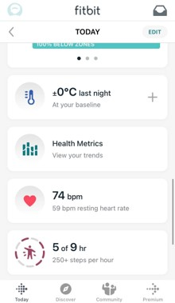
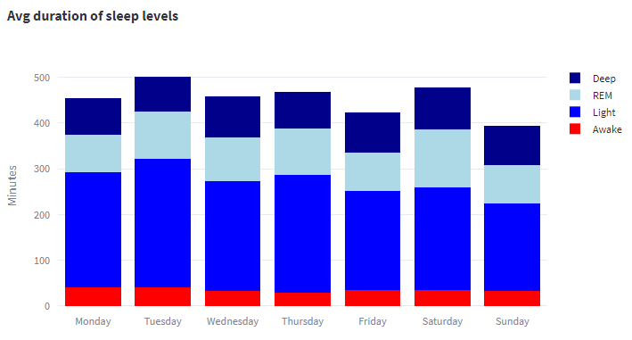

# Exploring Fitbit data with MongoDb and Python Streamlit

The Internet of Things (IoT) is a network of physical objects, devices, vehicles, buildings, and other items that are embedded with sensors, software, and connectivity, allowing them to collect and exchange data. One popular type of IoT devices are wearables, which are electronic devices that can be worn on the body as accessories or implants, such as smartwatches, fitness trackers, and medical monitoring devices. Wearables can track various data such as physical activity, heart rate, sleep patterns, and more. They have become increasingly popular due to their ability to provide users with personalized health and fitness data, as well as convenience and ease of use. Wearables can also be used in various industries, such as healthcare, sports, and entertainment, and have the potential to revolutionize the way we interact with technology on a daily basis.

One such device is Fitbit. Fitbit is the brand name for a series of smartwatches focused around, you guessed it, fitness. By wearing a fitbit you can have either through the smartwatch itself, or, in more detail, through the corresponding app, a data-based picture about different aspects of your life like sleep and activity.

If you are a tech person though you are not just limited on the visualizations or metrics that the Fitbit app provides. Fitbit allows developers to access a user's data (with the user's consent of course) in order to be able to either explore the data in the way they deem best, or more generally, build their own applications or dashboards based on their data.

For this project, our team was given a Fitbit Sense, which was worn by one of the people in the team in order to gather different data. Then, through the Fitbit API we were able to draw the data we wanted and with the help of MongoDb, a document based database, save these data in order to process them according to our needs. Finally we created some visualizations presented in a dashboard-like "webage" using the streamlit python module.

In this tutorial, we will go through the process of installing and set up MongoDb, creating Fitbit developer account, saving Fitbit data to a local MongoDb and using the saved data to display the data through python in a Streamlit website.

More specifically this article contains the following sections:

A. Installing and setting up MongoDb

B. Creation of Fitbit developer account

C. Interacting with the Fitbit API

D. Fetching Fitbit data and saving to MongoDb

E. Set up MongoDb and saving Fitbit data to a database

F. Give life to data through Streamlit

G. Streaming Fitbit data via Python

H. Machine Learning

For the full code we used, feel free to check [our Github repo](https://github.com/ThDiamant/FitbitProject.git).

## Installing and setting up MongoDb

To get started, download MongoDB Community Edition from the [official website](https://www.mongodb.com/try/download/community).

Select the desired version and OS system. For Windows execute the MSI file and install MongoDB Compass (a GUI for exploring your Mongo collections).

Then, we need to add the bin folder (usually the path to the folder will look like `C:\Program Files\MongoDB\Server\6.0\bin`) to the environmental variables of Windows.

Open a terminal and execute the following to make sure that MongoDB is installed correctly:

``` bash
mongod --version
```

Create a data directory for MongoDB. Open a terminal and run the following command:

``` bash
mkdir C:\data\db
```

This command will create a directory named "db" in the "data" directory on your C drive. MongoDB uses this directory to store its data.

Then to start the server you need to execute the following:

``` bash
mongod
```

## Creation of Fitbit developer account

Having set up our MongoDB, we will now see how to create a developer account for fitbit and register our application so that we can start drawing data from Fitbit's API.

You can find a detailed guide on how to do the above in [this](https://towardsdatascience.com/using-the-fitbit-web-api-with-python-f29f119621ea) great article by Michael Galarnyk, but we will also briefly cover some of the main steps.

First of all you have to [create a Fitbit account](https://accounts.fitbit.com/signup?targetUrl=https%3A%2F%2Fwww.fitbit.com%2Flogin%2Ftransferpage%3Fredirect%3Dhttps%253A%252F%252Fwww.fitbit.com&emailSubscribe=false&lcl=en_EU), which is very straightforward. The second and very important step is to register your application. To do that, click [here](https://accounts.fitbit.com/signup?targetUrl=https%3A%2F%2Fwww.fitbit.com%2Flogin%2Ftransferpage%3Fredirect%3Dhttps%253A%252F%252Fwww.fitbit.com&emailSubscribe=false&lcl=en_EU), and then from the top right select Manage>Register An App. In this step, there are two things we have to take care of:

1. Make sure to select "Personal" in the OAuth 2.0 Application Type. This will give you access to the "intraday" API endpoints, which basically contain more fine-grained time series on different topics. As an example, instead of getting the time serries which contains just the overall number of steps for each day, you will be able to access the time series representing the number of steps per second or 15 seconds for each day. This can be interesting for a number of reasons that we will cover later.

2. In the callback URL, use http://127.0.0.1:8080/ (i.e. localhost). This is important especially if you want to use the python-fitbit module for your API requests, since it is hardcoded in the module itself.

Upon completing this stage, you will be shown a picture like this:


Make sure to note all the information here, **especially** the *OAuth 2.0 Client ID* and *Client Server*, since these will be important for the authentication step in python.

And that's it with setting up the application! Make sure to wear the watch for a day and then you will be ready to get your data from Fitbit's API. Before we move on though, there's one important thing we should mention.

If you are interested in exploring data regarding Breathing rate, SpO2 levels (a.k.a. Oxygen Saturation) as well as Heart Rate Variability, there is one more small step you have to follow:

In the Fitbit app on your phone, tap on the "Today" tile, and then make sure to scroll down until you find the "Health Metrics" tile. Tap it, and then allow the device to start collecting the related data. If you don't do this step, even if you are wearing your device, it will **not** gather the data I mentioned until you manually enable it like we just discussed.




## Interacting with the Fitbit API

In this section we will be using the `python-fitbit` and the `requests` modules to get data from the Fitbit API. This is not the only way to do it, for example, a simple alternative would be to use the [Fitbit Web API Explorer](https://dev.fitbit.com/build/reference/web-api/explore/).

First, we have to proceed with the authorization from the Fitbit API and also define the Fitbit object in python which will be used to make some GET requests to the Fitbit API. In order to perform the authentication we will need the `CLIENT_ID` and `CLIENT_SECRET` which we have saved during the creation of the Fitbit account. So, to proceed with the authentication the following code should be executed:

``` python
# Authorize user
server = Oauth2.OAuth2Server(CLIENT_ID, CLIENT_SECRET)
server.browser_authorize()
# Save access and refresh tokens
ACCESS_TOKEN = str(server.fitbit.client.session.token['access_token'])
REFRESH_TOKEN = str(server.fitbit.client.session.token['refresh_token'])
EXPIRES_AT = str(server.fitbit.client.session.token['expires_at'])
```

Executing this codeblock, will redirect us to another tab in which we will be asked to login into our Fitbit account. Upon doing that we will see a page that should say something like "You are now authorized to access the Fitbit API!".

Given that the authentication has been completed as expected now we have an access token, a refresh token and the datetime when the access token will expire. By using them, we can proceed with the initialization of Fitbit object. So, to initialize it, the following code should be executed:

``` python
auth2_client = fitbit.Fitbit(client_id = CLIENT_ID,
                             client_secret = CLIENT_SECRET,
                             expires_at = EXPIRES_AT,
                             oauth2 = True,
                             access_token = ACCESS_TOKEN,
                             refresh_token = REFRESH_TOKEN)
```

## Fetching Fitbit data and saving to MongoDb

Now we are set and ready to proceed with fetching the Fitbit data. In this tutorial we will focus on two categories of data, the Sleep related data and the Activity related data or to be more precise the data which have to do with the level of our activity and the data which have to do with the number of our steps.

To get the Sleep related data we will use `requests` module, due to the fact that `python-fitbit` module has not been updated for a long time and it is using an older API version which is hardcoded in it's codebase. So, as we need to use version 1.2 instead of version 1 in order to get the Sleep related data in the desired format, we will perform this request manually through `requests` module.

To do that, we can use the Fitbit Web API Explorer to get the CURL of the endpoint we want to draw data from, convert it into python using the requests module and get the data we need.

An important note here is that there is a rate limit for each user who has consented to share their data. This limit is **150 API requests per hour** and it resets at the top of each hour.

Having said that, we can move on to the construction of the request. We are going to need a header object for our request which should contains the access token. An example of the request construction is visible below:

``` python
# Make API get request
headers = {
    'accept': 'application/json',
    'authorization': 'Bearer {}'.format(ACCESS_TOKEN),
}
try:
    response = req.get('https://api.fitbit.com/1.2/user/-/sleep/date/{}.json'.format(date), 
                        headers = headers)
except fitbit.exceptions.HTTPTooManyRequests as e:
    tryAfterMin = e.retry_after_secs/60
    errorMessage = str(e) + ", please try again after {:.1f} min.".format(tryAfterMin)
    raise Exception(errorMessage)
```

The response object contains every information we need for the Sleep related data of the given date. For the fields it returns as well as an example response you can check the [API documentation](https://dev.fitbit.com/build/reference/web-api/sleep/get-sleep-log-by-date/).

Before checking out how to add those data to MongoDb, let's also have a look on how we fetch the Activity data. In order to fetch them we used the `python-fitbit` module and we will target two specific "variables", also known as "resources" in the Fitbit documention: steps and minutes active/sedentary. The first thing we have to do is to create a list with the target resources in order to minimize the code duplication e.g. "activities/steps", "activities/minutesVeryActive" etc. Then based on the selected resource, we will determine which should be the detail level of the data (1, 5 or 15 minutes). For steps we select 1 minute so that we have as much detailed information as possible,while for the rest of the resources we select 15 minutes due to the fact that 1 minute will return binary values (1 or 0) based on the activity on this minute. This is not necessarily a problem, but we thought it would be better to have a timeseries that does not look too "square".

The code which we executed in order to perform the above was the following:

``` python
for resource in resources:
    if resource == "steps":
        detailString = "1min"
    else:
        detailString = "15min"
    
    # Use fitbit module to make the API get request
    data[resource] = auth2_client.intraday_time_series(resource, date, detail_level = detailString)
```

## Set up MongoDb and saving Fitbit data to a database

In this tutorial we will use `pymongo` module in order to communicate with the MongoDb we installed in a previous section. The first thing we have to do, is to establish connection with the database. To do so, execute:

``` python
import pymongo as mongo
client = mongo.MongoClient('localhost', 27017)

# Check if the connection to the db was successful
try:
    db = client.admin
    server_info = db.command('serverStatus')
    print('Connection to MongoDB server successful.')
    
except mongo.errors.ConnectionFailure as e:
    print('Connection to MongoDB server failed: %s' % e)
```

If everything goes well, we will get the message "Connection to MongoDB server successful". If not, then there might be an issue with Mongo, in which case we can try to re-install it to make sure no errors happened there, or, google (or use ChatGPT) in order to find what the specific issue is :).

The next step is to create a new database and a collection in it in order to save the data. To do so, execute the following code:

``` python
fitbitDb = client[DB_NAME]
fitbitCollection = fitbitDb.create_collection(COLLECTION_NAME)
```

In the above we see the global variables `DB_NAME` and `COLLECTION_NAME`. These are simple string variables like `"fitbitDb"` and `"fitbitCollection"` respectively.

One last step before inserting the data to our Mongo database is to create an index. This index will help up both in performance and especially in the validity of our data. With the usage of a custom index, we are able to use some fields in order to check if there is already a document with the same values in them. In our case, we can use `resource type` and `data.dateTime` fields for the index as we already know that a document in our collection is uniquely identified through the combination of these two fields. If for some reason a duplicate record is entered in our Mongo collection, then our program will throw a `DuplicateKeyError` exception to let us know that we re trying to add a duplicate. Using a `try-except` block we can catch this exception and decide what we want to do in the case of duplicates (e.g. ignore it, update the record e.t.c.). The code to define the index is the following:

``` python
fitbitIndex = [('type', mongo.ASCENDING), ('data.dateTime', mongo.ASCENDING)]
# Check if the index exists
if indexName not in [fitbitIndex['name'] for fitbitIndex in collection.list_indexes()]:
    # Create the index if it does not exist
    collection.create_index(fitbitIndex, name = indexName, unique=True)
```

Now that we have taken care of data duplication in our database, we are ready to proceed with loading the data from the Fitbit API to MongoDb. By using the manual request as well as the `fitbit-python` module we perform multiple requests for every day starting from 28/03/2023 until the last day we have data for (this will not necessarily be "today", because we have to return the Fitbit smartwatches back to the teaching assistants). For each request we manipulate the data in order to create a dictionary with the following format:


Each object represents a document. The last part to save a document to our database is to use the collection which was created before. So, by using this collection we execute the following code for each document:

``` python
try:
    # Insert myDocument in Mongo
    result = fitbitCollection.insert_one(myDocument)
    # Check if the document was inserted successfully
    if not result.inserted_id:
        raise Exception(f"Document {myDocument} not inserted.")
    # If record already exists an exception is raised due to the index
except mongo.errors.DuplicateKeyError:
    pass
```

Having all the data stored in our MongoDB collection, we are ready to start creating some visualizations and investigate the wearer's sleep and activity patterns. We do that through the python module called "Streamlit".

## Give life to data through Streamlit

Streamlit is an open-source Python library that allows you to build interactive web applications with simple Python scripts. In our project we used it in order to visualize our Fitbit data and present them in a dashboard-like way.

In order to begin with streamlit, we create a new separate file in order to execute it via the command line like so: `streamlit run streamlit_example.py`. This command will launch a web UI page which will run in `http://localhost:8501/`. There is also the possibility to assign another domain if you need to run it on a server but we will not analyze this part in the current article.

The next step is to create a pandas dataframe by using the saved data. To fetch the required data, we need to execute a query in our MongoDb. This query should contain the document `type` and other fields like `data.dateTime`. Also, regex can be used for more complex queries. An example can be shown below:

``` json
{
    "type": "sleepLevelsData-data",
    "data.dateTime" : {
        "$regex" : "2023"
    }
}
```

Having said that, we can now perform multiple queries to the database in order to get the required data for our widgets.

Lets start with a summarization of our data. The widget below takes under account the selected data based on a slider:

```python
# Define the slider widget for the numeric indicators
date_range = st.slider(
    ":calendar: Please select the date period you want to consider:",
    min_value=start_date,
    max_value=end_date,
    value=(start_date, end_date),
    format="DD MMM YYYY")
```

For these data we calculate the average sleep duration, average sleep time, average sleep efficiency and average steps for the entire date range defined by the slider widget. Furthermore, we also created two pie charts to summarize the duration for each activity level and sleep stage for the date range we explore. To display them we use the following code:

``` python
tot_avg_sleep_duration = get_avg_sleep_duration(date_range)

# ----- Sleep start time (most common one)
most_common_hour, nNights = fun.get_most_common_sleep_start_time(date_range)

# ----- Avg sleep efficiency
avg_sleep_efficiency = fun.get_avg_sleep_eff(date_range)

# ----- Avg number of steps
avg_steps = fun.get_avg_steps(date_range)

# Show the metrics side by side
col1, col2, col3, col4 = st.columns(4)
with col1:
    st.metric(label=':sleeping: Avg sleep duration',
              value=f'{tot_avg_sleep_duration} hours')
with col2:
    st.metric(label=f':new_moon_with_face: Most common sleep hour',
              value=f'{most_common_hour} a.m.')
with col3:
    st.metric(label=f':ok_hand: Avg sleep efficiency',
              value=f'{avg_sleep_efficiency} %')
with col4:
    st.metric(label=f':walking: Avg steps',
              value=f'{avg_steps}')
```

The result of this part of code can be shown below:


We can see here that the person wearing the Fitbit seems to be getting adequate sleep in general (given that most experts reccommend 7-9 hours of sleep per night). Additionally this person seems to be a bit of a nightowl sleeping generally around midnight or even past midnight. This person is also quite active achieving the general goal of 10.000 steps per day on average.

Another interesting conclusion is the fact that the distributions of the sleep and activity levels seem to be quite robust. We can see that by selecting different ranges of dates to consider, both with respect to the number of days, as well as the start and end dates. Regarding sleep, we see that Light Sleep accounts for 50% of the sleep stages, with the next larger sleep stage being REM sleep with roughly 20% of the sleep. Similarly, we see that activity of various levels, accounts for more than 25% of the users state, with the rest corresponding to the wearer being sedentary. One first conclusion we could draw, could be that hitting the 10k step mark, equals to being active for 1/4 of the day. On the other hand, we see that even by hitting the 10k steps mark, almost 3/4 of the wearer's day is in a sedentary state, which is one side effect of modern living: as data scientists we sit at work, then return home and sit to watch TV or at the computer etc.

Having now a general picture, let's get a more detailed view of the data. In our next two visualizations we will use a date picker in order to select the date for which we want to see data. The data we see now, are the time series of the sleep stages and the activity levels throughout the selected date. To configure all this, we use the following code:

```python
# Define date widget
date = st.date_input(
    label=":calendar: Date selection",
    value=start_date)

# Make sure the selected date is within the correct limits
if date < start_date:
    st.write(f":exclamation: Selected date cannot be before {start_date.strftime(DATE_FORMAT)}."
             f"Please select another date.:exclamation:")
elif date > end_date:
    st.write(f":exclamation: Selected date cannot be after {end_date.strftime(DATE_FORMAT)}. "
             f"Please select another date.:exclamation:")
else:
    <Code that creates the two plots>
```

Then we will fetch the data of this date in order to create the mentioned widgets. The first one will display the sleep stages over time for the target date while the second one will display the activity stages over time for the target date. At the end, our widgets will look like the following:


By playing around with the different available dates, we can start drawing some conclusions about the wearer's sleep and activity.

Regarding sleep, we see that for most days the "Light Sleep" stage is the dominant one, followed by REM, as we expected from what we saw from the previous visualizations. We also see the following interesting pattern: Deep Sleep (which is the stage of sleep where the body does most of its repair work), seems to happen most times in the first half of sleep, and there seems to be an oscillation between Deep Sleep and the other stages. It looks like there is a form of cycle happening where the wearer goes from Light to Deep sleep, where some times they also stay at REM, or are Awake. We should clarify that "Awake" here does not necessarily mean that the wearer actually wakes up, but that they are not "asleep enough" (i.e. may be turning in bed).

Regarding activity, we can clearly see the hours within the day when the wearer goes to the gym by a sudden spike in activity, expressed mostly through the Fairly and Very Active levels. We can see that some days they go to the gym in the morning/early afternoon, and others in the evening around 17:00-18:00.

One fun observation is the increased activity level around midnight of 29 March. We know for a fact that on that day and hour, the wearer was at a live gig, so we can actually see them enjoying themselves in the crowd by producing high levels of activity!

In the next section of our streamlit dashboard, we took a look at some averages per day of week. More specifically, we have the average steps, average duration of sleep levels and average duration of activity levels per day of week.



From this plot, we can see that although there is some variation between the duration of sleep levels throughout the week, it does not seem to be very significant (a statistical test would be necessary in order to be sure though). What's interesting is the fact that the number of minutes that the wearer spends in the "Awake" stage seems to be the same throughout different days. The same goes for Deep Sleep. Most variation between days comes mostly from the number of minutes in Light sleep.


In this plot a clear pattern emerges: the wearer is increasingly active as the week progresses, with Saturday being the day they are mostly active, closely followed by Friday. Given that most people go out with friends, or take quick weekend trips on these days, this can explain the high number of steps on these days. One thing is clear from this graph though: the wearer does not seem to like Mondays since they seem to be the days they are mostly sedentary! This can be seen even more clearly from the activity level breakdown per day of week:


We can see that this plot complements the previous one in that the number of minutes the wearer spends sedentary per day is inversly related to the their number of steps. We can also see that they are the most active in the days from Thursday to Saturday, as the number of minutes they spend being very active seems to be the most on these days (which is also what we saw in the previous plot).

Another visualization we came up with, was the following:


Here we can see the minutes per activity level (excluding the "Sedentary" level), per day for the entire period we consider. With this kind of plot we can check for any larger patterns which could classify as habbits given the sample size we have. A habbit we can see here is that the wearer seems to spend some days in which they are very active, followed by a few days in which they are not as active as opposed to a habbit or lifestyle in which they are more or less consistently active throughout time.

Having taken an extensive look at the sleep and activity habbits of the wearer, we now shift our focus to examining the relationship between these two. We all more or less know that if you are very active you will be more tired and therefore sleep more. Is this the case for the wearer? What about sleep quality? Is it affected by how active the wearer is? Let's try to answer these questions through some more visualizations.

As a first step, we tried to visualize the relationship between the sleep levels' furation and the number of steps, using a 3D plot. This plot is actually interactive in the streamlit app, so we can move the plot around and zoom in or out to get a better idea of how the plotted variables may correlate with each other.


From this plot there seems to be a positive correlation between the number of minutes spent in REM, Light and Deep sleep which seems reasonable given the robustness of the distribution of the sleep levels we saw in the first barplot. This means that if someone sleeps longer, then they will spend more time in each stage instead of spending more time in a specific sleep stage.

From the bubble fill color, we can also see a slight positive correlation between the number of steps and REM and Light sleep, since they bubble seem to have a darker color for points which correspond to more Light and REM sleep.

Let's take a better look though at the variables under investigation through a correlation matrix.


From this plot we see a few things:

1. The different sleep levels are correlated with each other, but the strongest correlations seem to be between Deep and REM and Light and Wake. This means that we can expect to have more Deep sleep if we also have more REM sleep, and similarly for Light sleep and being Awake.

2. Steps is positively correlated with the minutes spent in Light, Fair and a lot of activity (with increasing strength as well), and negatively correlated with the minutes the wearer spent sedentary. Although this seems quite obvious, the fact that the correlation is stronger as the intensity of the activity increases, tells us that probably, when the wearer had larger values for their number of steps per day, they got these steps more from intense exercise, than by lower intensity exercise. This also complements what we previously saw regarding the habbit of the wearer to be very active for a few days and then spent the next couple of days not being very active.

3. Sleep Efficiency is mostly correlated (positively) with Light sleep, although that correlation is not very strong.

4. All sleep levels are inversly correlated with the minutes spent sedentary, especially REM, which is also positively correlated with the number of minutes spent being very active. This could give us an indication towards the "more exercise means better sleep" hypothesis. We could say that exercise seems to mostly impact REM sleep.

Before continuing there is something we should address: since all of our data are sequential data (i.e. timeseries), treating it as simple numeric data and calculating the Pearson correlation between them might seem a little weird for some people and that's fair enough. In doing that, we ignore any correlation regarding the sequence of the data, for example, we cannot see if high activity on one day correlates with better sleep in the next. In order to do that we would need to compare the different time series among themselves, and that's what we do with the next plot:


In this plot the user can select any number of variables we examine from the widget at the top and add them to the plot and see how they relate to each other. Furthermore, we added a widget that can perform resampling (the choices being no resampling, 2 days, 3 days, 4 days) in case the user wants to see the timeseries more "smoothed". In addition, all the timeseries have been normalized to take values between 0 and 1 for better visualization.

Some interesting remarks from this plot are:

1. There does seem to be a correlation between steps and sleep efficiency. More specifically, it seems that many days with relatively high number of steps are followed by days with relatively high sleep efficiency score. This is more obvious if we use the 2d (2 days) resample for the plotted time series.

2. Sleep levels seem to be very correlated with each other. We have seen that before, but it's nice to verify it again.

3. Activity levels (light, fair, very active) seem anticorrelated with the sedentary timeseries and correlated with each other as we have seen before.

4. Deep sleep and Light Activity also seem to correlate relatively well. This is the type of activity with which Deep Sleep correlates best, which is a bit surprising: it seems like deep sleep does not necessary require very intense exercise.

Concluding this section, let us summarize our key takeaways:

- The wearer is a relatively active person achieving the 10k steps mark in general. They prefer to exercise either before 12:00 or around 18:00. They are most active on Fridays and Saturdays and the least active on Mondays. Their activiy profile is characterized by days of higher activity followed by a couple of less active days.

- The wearer seems to be getting adequate sleep, although they tend to go to bed relatively late.Around 50% of their sleep is spend in Light sleep stage, with an oscillation between Deep and Light sleep on most days. There doesn't seem to be a day in the week when they sleep best.

- The days they have a high step count, it is mostly due to intense activity. Exercise seems to positively affect Light Sleep the most. Deep sleep and Light Activity also seem to go together.

## Streaming Fitbit data via Python

Fitbit supports the creation of subscription on specific endpoints. Although, a server is required in order be used for the communication and the creation of the subscribers. Given the absence of the server, we implemented a manual logic in order to support stream operation.

It is expected that a streaming application should remain running as long as we need to. Given that, we used a `while True` loop with a sleep of 15 minutes between the re-execution of the code. 

The next step is the fetching of the new data. Every 15 minutes a request is sending in order to get the data of the target date (today). Also, when we spot a change in the day we send two requests, one for the new day and one for the previous, to make sure that we wont lose any data. It is important to mention that the time is set to 15 minutes in order to avoid reaching the limit of 150 requests per hour.

One last important step is that when we pull the data, we are using only the data which have been generate at least 15 minutes before. Fitbit has a delay in the synchronization of the data so if we fetch all the data we are going to have wrong values e.g. steps are 0 will we were walking.

To sum-up, the code which was used for the streaming functionality is the following:

``` python
currentDate = dt.datetime.now().date()
while True:
    try:
        # Use now before 15 minutes. This is due to the fact that fitbit does not update it's data right away 
        now = dt.datetime.now() - dt.timedelta(hours=0, minutes=15)
        single_date = now.date()

        if (now.day != currentDate.day):
            # Make sure that the date from the previous date have been imported
            importData(currentDate)
            currentDate = now
        importData(single_date)
    except Exception as e:
        print('Error: %s' % e)

    # Wait for 15 minutes before making the next request
    # By doing so we can make sure that threshold of 150 queries per hour wont be reached
    tm.sleep(15*60)
```

## Machine Learning

Now that we have succeed in detecting the relationships between our available variables, let’s try to implement some simple Machine Learning techniques and scenarios.

Scenario number one is to implement the AutoRegression model in our data, but let us have a look first about this algorithm. AutoRegression (AR) is a statistical model used in time-series analysis to make predictions about future values of a variable based on its own past values. The model assumes that the future values of the variable can be predicted as a linear combination of its past values, with some error term added to account for any unexplained variation. The order of the AR model indicates the number of past values used to make predictions, and the coefficients of the model are estimated using a method such as maximum likelihood estimation. AR models are commonly used in finance, economics, and other fields where predicting future values based on past trends is important.

Now, let’s jump straight to the implementation.
Preferably, the time series that the model will get as input should not have any missing 
values, so we are making sure to deal with that problem first.

``` python
ts = ts.rolling(window=3, min_periods=1).mean().fillna(method='bfill')
```

Using a rolling window, we will fill the potential NA values with the mean value of a specified window. Keep in mind that there are many more techniques you could use to fill the NA values.

Next step will be to define our model and train it. We are using the AutoReg class from the statsmodels module, use the pip command to install it to your current python environment.

``` python
! pip install statsmodels
```

The inputs will be a dataframe that will have dateTime objects as indexes and containing only one column with the values of our series. Then we need to also define the lags that the algorithm will utilize.

``` python
from statsmodels.tsa.ar_model import AutoReg

model = AutoReg(ts, lags=n)
model_fit = model.fit()
```

A lag of 10 means that the current value of the dependent variable is being regressed on the 10th lagged value of that same variable. In other words, the value from 10 time periods (days in our case) ago is being used as one of the predictors to forecast the current value. The value of 10 is known as the lag order, and it can be adjusted to incorporate more or fewer past values depending on the specific characteristics of the time series being analyzed. A higher lag order will increase the complexity of the model, but it may also improve its accuracy in making predictions.

Last, then only thing left is to get the prediction from our model

``` python
forecast = model_fit.forecast(steps=10)
```

The number of steps defines our forecast horizon, meaning how many days after today we want to have forecast. So steps equal to 10 will give us a forecast for the next 10 days.

In our Streamlit app, we have included the flexibility to modify the dependent variable between two options, namely `sleepEfficiency` and `Steps`. Additionally, we have enabled the users to adjust the forecast horizon as per their requirements. This feature provides greater control to the users and helps them to tailor the analysis to their specific needs. The results are the following:


As we've observed, by increasing the lag period and forecast horizon, the model is able to capture the seasonality of the time series data more effectively. This means that as we expand the range of historical data used to make predictions, we are able to better capture patterns and trends in the data that may repeat over time, such as daily or weekly cycles.

To leverage the full potential of the available variables and capture their complex relationships, we are taking a step forward and implementing a more advanced approach using neural networks. Specifically, we are exploring the use of Long Short-Term Memory (LSTM) models to analyze the time-series data. LSTM is a type of recurrent neural network that can handle input sequences of varying length and can capture long-term dependencies between variables. By using LSTM, we can improve the accuracy of our predictions and gain deeper insights into the behavior of the time-series data.

To leverage the power of multiple variables, we have decided to focus on the calendar range of the available data. This allows us to experiment with a variety of independent variables and calculate an error metric to evaluate the accuracy of our model. For this analysis, we have selected sleepEfficiency as the dependent variable, and have chosen a few key features from the activity logs as the independent variables. Specifically, we will be using the number of steps and the time of day for each activity stage (fairly active, lightly active,
sedentary, and very active) to help predict sleep efficiency. 

To test the accuracy of our model, we will be using a rolling test set approach, where the test set consists of the last 5 time periods (days) of our data. This approach allows us to continually evaluate the performance of our model over time and make any necessary adjustments to improve its accuracy.

We need to use the tensorflow library to access the necessary function and classes, again using pip we can install it in our environment.

``` python
! pip install tensorflow
```

Now let’s create a simple LSTM model:

``` python
from tensorflow.keras.models import Sequential
from tensorflow.keras.layers import Dense, LSTM


model = Sequential()
model.add(LSTM(lstm_nodes, activation='relu', input_shape=(1, 5)))
model.add(Dense(25))
model.add(Dense(10))
model.add(Dense(1))
model.compile(optimizer='adam', loss='mse')
```

The above code snippet shows the architecture of a neural network that uses a Long Short-Term Memory (LSTM) model. The first line creates an instance of a Sequential model, which is a linear stack of layers. The next line adds an LSTM layer to the model with the specified number of nodes, using the ReLU activation function. The input_shape parameter indicates that the input to the LSTM layer is a sequence of length 1 (i.e., a single time step) and width 5 (i.e., 5 variables). The next three lines add three Dense layers to the model, each with a different number of nodes. The final Dense layer has a single node, which is the output of the model. The model is compiled using the Adam optimizer and the mean squared error (MSE) loss function, which is commonly used for regression problems. Overall, this architecture is designed to process a single time step of input data with five variables, and output a single value that represents the predicted value for the next time step.

Then we need to train our model and get our predictions

``` python
model.fit(X_train, y_train, epochs=100, batch_size=1, verbose=0)
y_pred = model.predict(X_test)
```

To evaluate our results, we will calculate the an error score. The one we select for now is the
Mean Absolute Percentage Error (MAPE). It is a popular metric used to evaluate the accuracy of forecasting models. It measures the average percentage difference between the forecasted values and the actual values. MAPE is calculated by taking the absolute difference between the forecasted value and the actual value, dividing that by the actual value, and then taking the average of these values across all observations. The resulting value represents the percentage error in the forecast. MAPE is expressed as a percentage, with lower values indicating better accuracy. MAPE is a useful metric for evaluating the performance of forecasting models because it provides a measure of accuracy that is easy to interpret and compare across different datasets and models. However, it can also be sensitive to extreme values, so it is important to consider other metrics as well when evaluating the performance of a model.

In this case, the dynamically defined parameters include the number of nodes in the LSTM layer and the number of epochs for the model training. The results are the following:


Despite our use of a simple model architecture, we've observed that our forecasts have a low error rate. This is a promising result, as it suggests that even with a relatively basic approach to time series forecasting, we are able to make accurate predictions. It's important to note that model architecture is just one factor that can influence the accuracy of time series forecasts, and there are many other factors that can also play a role, such as the choice of independent variables, the range of historical data used, and the specific techniques used to preprocess and normalize the data. Nevertheless, our initial results are encouraging and suggest that even with limited resources or expertise, it is possible to generate accurate forecasts using a simple model architecture.

Both of the approaches we've discussed in this article are simple examples designed to introduce you to some of the basic techniques for time series forecasting. Of course, there is always room for improvement, and there are many ways to fine-tune and optimize these models to achieve even better results. One important area for improvement is feature selection and engineering, which involves identifying the most relevant independent variables to include in the model, and creating new variables based on insights into the underlying patterns and drivers of the data. Additionally, model hyperparameters can be fine-tuned to further optimize the model's performance on a specific dataset. These are just a few examples of the many ways in which the techniques discussed in this article can be extended and enhanced to produce even more accurate and useful forecasts.


